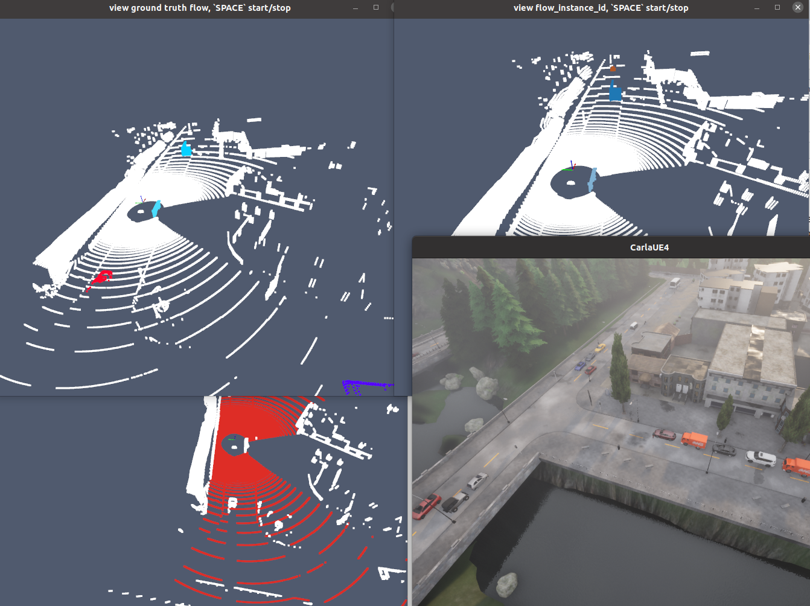

SynFlow: Scaling Up LiDAR Scene Flow Estimation with Synthetic Data
---

[](https://arxiv.org/abs/2604.09411)
[](https://kin-zhang.github.io/SynFlow)
<!-- [](https://github.com/Kin-Zhang/SynFlow/discussions/1) -->
<!-- [](https://drive.google.com/file/d/1RNwMUiw1lEZ9DRPAZrBb6f0geLEJUCe2/view?usp=sharing) -->
<!-- [](https://youtu.be/BV47IUSEOgE) -->

<p align="center">
  
</p>

SynFlow got accepeted in ECCV2026, I'm updating the repo and README, stay tuned for the dataset release and code release! Timeline and TODO:
- [x] 2026-06-18: Initial the repo and add README.
- [ ] Update the CARLA code for dataset generation and add the dataset generation instruction in README.
- [ ] Upload the dataset to Huggingface and add the download link in README.
- [ ] Add review comment and rebuttal pdf and poster link


## Prerequisites

Test computer and sftool (py38):
- Desktop setting: i9-12900KF, GPU 3090
- System setting: Ubuntu 20.04, Python 3.8
- Test Date: 2025-12-07, CARLA Version: 0.9.15, Using the conda env sftool (py38)


### CARLA Installation


## Synthetic Dataset Generation

SynFlow-4k Dataset Donwload Link
| Dataset/Model |Download Link | Description |
|:---------------------:|:-------------:|:-----------------:|
| SynFlow-4k | [huggingface TODO](TODO) | It contains around 4k scenes includes 940k frames with 3D flow ground truth... TODO |
| DeltaFlow weight (trained on SynFlow-4k) | [huggingface TODO](TODO) | Model trained on SynFlow-4k dataset, which can be used for evaluation and as a pretrained model for real-world data finetuning. |
| DeltaFlow weight (trained on SynFlow-4k with real-world data) | [huggingface TODO](TODO) | Model trained on SynFlow-4k dataset with real-world data, which can be used for evaluation and as a pretrained model for real-world data finetuning. |

### Step 1: Generate route


### Step 2: Generate dataset

You can launch more than 1 CARLA simulator (on different ports) to collect data in parallel. 
Each process collect 1 route at a time.

Check [conf/collect.yaml](conf/collect.yaml) to modify the sensor settings, NPC density, etc.

```bash
# Launch CARLA simulator first
./CarlaUE4.sh --quality-level=Epic -carla-rpc-port=2010

# In another terminal, run the data collection script
python collect_data.py simulation.route_file="./assets/data/town10.xml" 'simulation.route_id=3' simulation.port=2010 simulation.data_output="/home/kin/data/CARLA/data-64-test" sensors.lidar_semantic.channels=64 simulation.max_frames_per_scene=1000 world_settings.logging_level="DEBUG" simulation.record_carla_log=false
```

When you are ready for full data collection, you can use a bash script to launch multiple processes or :
```bash
# Here is 32-channel LiDAR setting example
python collect_data.py sensors.lidar_semantic.channels=32 sensors.lidar_semantic.points_per_second=160000 'simulation.route_id=[0,1,2]' simulation.port=2000 'simulation.route_file=/home/kin/data/CARLA/CARLA_0.9.16/PythonAPI/opensf-carla/assets/data/town01.xml' world_settings.logging_level="DEBUG"

```

For convenience, you can also use the provided [run_all.py](run_all.py) script to manage multiple CARLA instances and data collection processes. This script includes automatic restart mechanisms in case of crashes.

```bash
python run_all.py --port 2000 --townids "01,02" --data_dir /home/kin/data/CARLA/data-64-460k-7k -m 1000 -s 0 -c 64
```

Key arguments:
- `--port`: CARLA RPC port (TrafficManager uses port+8000 automatically)
- `--townids`: comma-separated town IDs, processed sequentially
- `-c`: LiDAR channel count (32 or 64)
- `-s`: start route ID (useful for resuming large maps like Town12)
- `-r`: restart every N routes for memory management (default: 25)
- `--stall_timeout`: restart if no output for N minutes (default: 20); CARLA can freeze without crashing after long runs — this detects and recovers from that case
- `--max_ram_gb`: emergency restart if system RAM exceeds N GB (default: 55)

**Restart triggers** (automatic, no manual intervention needed):

| Trigger | Cause | Restarts CARLA? |
|---------|-------|-----------------|
| `CARLA_CRASH` | CARLA process died | Yes |
| `SEGFAULT` | collect_data.py segfault | Yes |
| `STALL` | No stdout for `stall_timeout` min (frozen) | Yes |
| `ERROR` | collect_data.py non-zero exit | Yes |
| `MEMORY_RESTART` | N routes completed (memory leak prevention) | Yes |
| `RAM_EXCEEDED` | System RAM > max_ram_gb | Yes |

Run multiple parallel instances by launching with different `--port` and `--data_dir`:
```bash
# Instance 1: Town01-02 on port 2000
python run_all.py --port 2000 --townids "01,02" -c 64 --data_dir /data/set-a &

# Instance 2: Town03-05 on port 3000
python run_all.py --port 3000 --townids "03,05" -c 64 --data_dir /data/set-b &
```

### Step 3: Visualize data

You may need create index file `index_total.pkl` first by running:
```bash
python create_data_index.py --data_dir /home/kin/data/CARLA/CARLA_0.9.16/PythonAPI/data
```

As we already save the data in the OpenSceneFlow format, we can directly use the OpenSceneFlow visualization tool to visualize the collected data.

```bash
cd OpenSceneFlow
python tools/visualization.py --res_name flow --data_dir /home/kin/data/CARLA/CARLA_0.9.16/PythonAPI/data
```



#### Some noted issues

1. Town12 no pedestrian spawned or no walking pedestrian, check https://github.com/carla-simulator/carla/issues/6552#issuecomment-3700038363.

Downloaded the zip file then put the bin file to `/path/to/carla/CarlaUE4/Content/Carla/Maps/Town12/Nav/Town12.bin`.

2. CARLA simulator crash during data collection. Known issues: ; so I added auto-restart mechanism in [run_all.py](run_all.py) to restart the simulator when crash detected. but still need to investigate on Town12 crash issue for some route id.


## Model Training and Inference

1. Python Environment Setup: Follow the [OpenSceneFlow](https://github.com/KTH-RPL/OpenSceneFlow/tree/main?tab=readme-ov-file#0-installation) to setup the environment or [use docker](https://github.com/KTH-RPL/OpenSceneFlow?tab=readme-ov-file#docker-recommended-for-isolation).
2. Dataset Preparation: Download the SynFlow dataset and prepare the [TODO]
3. Run Command: The training with the following command (modify the data path accordingly):
```bash
TODO
```

### Evaluation

Trained your own model or downloaded the pretrained weights from [Table](#link to above table)

Please check the local evaluation result (raw terminal output screenshot) in [this discussion thread TODO](https://github.com/Kin-Zhang/SynFlow/discussions/2). 
You can also run the evaluation by yourself with the following command with trained weights:
```bash
python eval.py checkpoint=${path_to_pretrained_weights} dataset_path=${demo_data_path}
```

## Cite & Acknowledgements

```
@article{zhang2026synflow,
  author    = {Zhang, Qingwen and Zhu, Xiaomeng and Jiang, Chenhan and Jensfelt, Patric},
  title     = {{SynFlow}: Scaling Up LiDAR Scene Flow Estimation with Synthetic Data},
  journal   = {arXiv preprint arXiv:2604.09411},
  year      = {2026},
}
```
This work was partially supported by the Wallenberg AI, Autonomous Systems and Software Program (WASP) funded by the Knut and Alice Wallenberg Foundation and Prosense (2020-02963) funded by Vinnova. 
